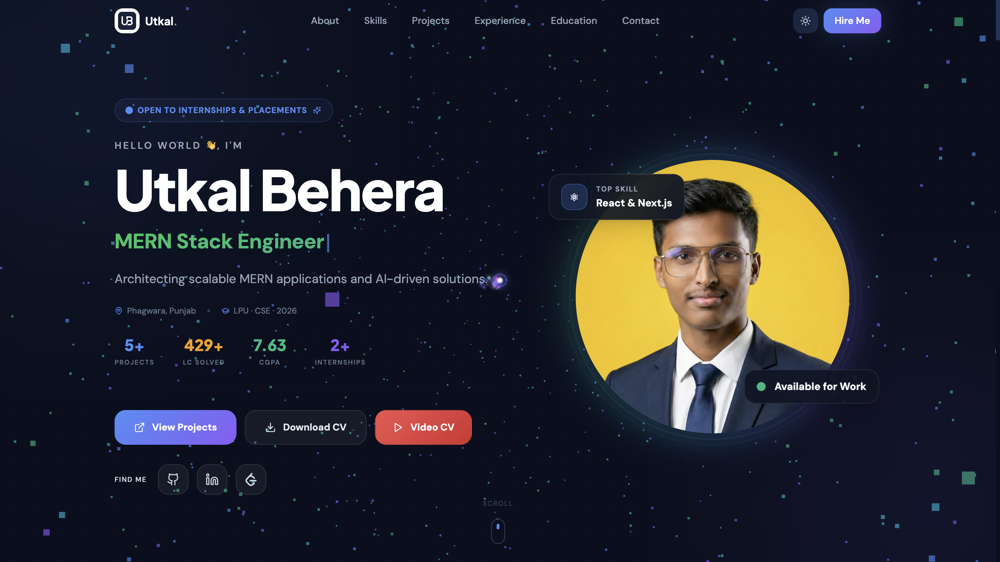
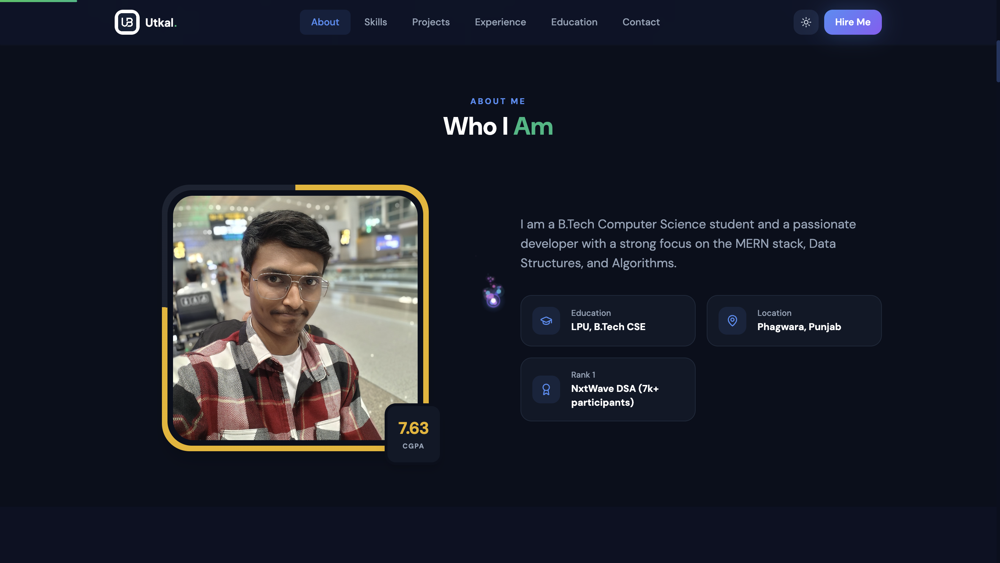
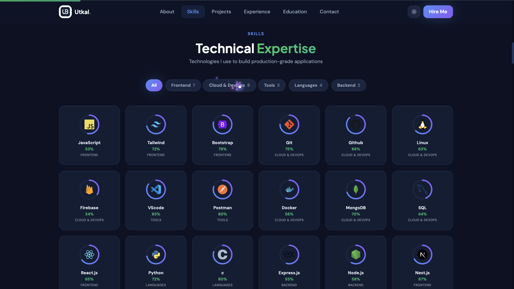
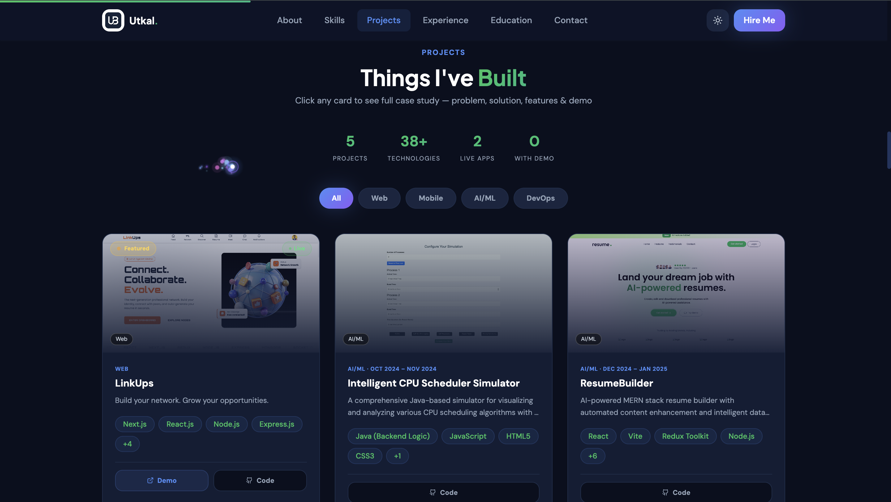
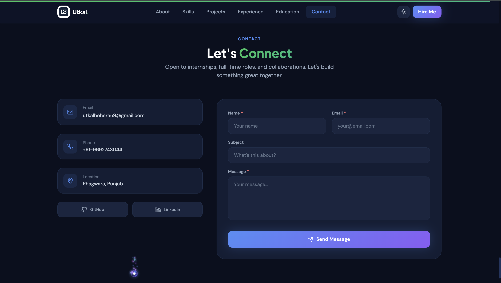
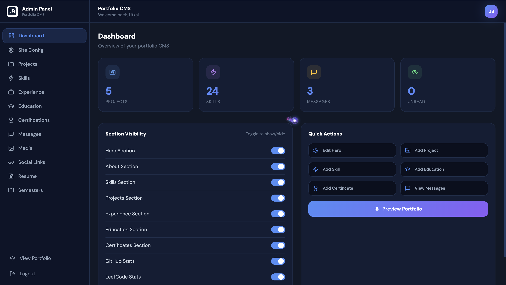
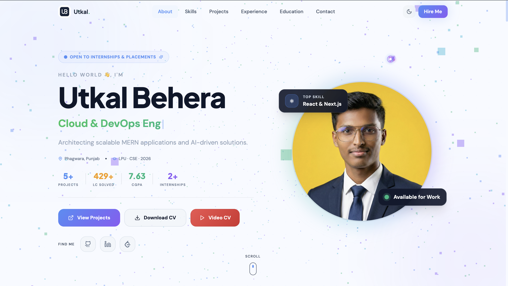

<div align="center">

# 🚀 Utkal Behera — Developer Portfolio CMS

### A Modern Full Stack Portfolio with a Powerful Content Management System

<p align="center">

</p>

<p align="center">

<a href="https://my-portfolio-nu-flax-96.vercel.app">

</a>

<a href="https://github.com/Utkal9/My-Portfolio">

</a>

<a href="https://www.linkedin.com/in/utkal-behera59/">

</a>

<a href="mailto:utkalbehera59@gmail.com">

</a>

</p>

<p align="center">


</p>

</div>

---

# 📖 Table of Contents

- [Overview](#-overview)
- [Live Preview](#-live-preview)
- [Screenshots](#-screenshots)
- [Features](#-features)
- [Tech Stack](#-tech-stack)
- [Project Structure](#-project-structure)
- [Installation](#-installation)
- [Environment Variables](#-environment-variables)
- [Admin Dashboard](#-admin-dashboard)
- [Architecture](#-architecture)
- [API Overview](#-api-overview)
- [Deployment](#-deployment)
- [Security](#-security)
- [Performance](#-performance)
- [Future Roadmap](#-future-roadmap)
- [Contributing](#-contributing)
- [License](#-license)
- [Author](#-author)

---

# 🌟 Overview

This project is **much more than a traditional personal portfolio**.

It is a **production-ready Portfolio CMS** that allows complete website management through a secure Admin Dashboard.

Instead of editing source code whenever new projects, skills, education, or experiences need to be added, everything can be managed dynamically from the dashboard.

The application combines a modern frontend experience with a scalable backend architecture, making it suitable as both a professional portfolio and a reusable CMS template.

---

# 🌐 Live Preview

### 🚀 Portfolio Website

> https://my-portfolio-nu-flax-96.vercel.app

### 💻 GitHub Repository

> https://github.com/Utkal9/My-Portfolio

---

# 📸 Screenshots

## 🏠 Hero Section

<p align="center">

</p>

---

## 👨 About Section

<p align="center">

</p>

---

## 💻 Skills

<p align="center">

</p>

---

## 🚀 Projects

<p align="center">

</p>

---

## 📬 Contact

<p align="center">

</p>

---

## ⚙️ Admin Dashboard

<p align="center">

</p>

---

## ☀️ Light Theme

<p align="center">

</p>

---

# ✨ Features

## 🎨 Beautiful User Experience

- Modern Responsive Design
- Light & Dark Theme
- GSAP Page Animations
- Framer Motion Transitions
- Three.js Interactive Background
- Particle Cursor Effects
- Mobile First Layout
- Smooth Scrolling
- Elegant Typography

---

## 📂 Dynamic Portfolio CMS

Everything can be managed from the Admin Dashboard.

### Supported Modules

- Hero Section
- About
- Skills
- Projects
- Experience
- Education
- Certifications
- Resume
- Semester Details
- Contact Information
- Social Links
- SEO Settings

---

## ⚙️ Powerful Admin Dashboard

The project includes a complete CMS.

### Dashboard Features

- Secure Login
- JWT Authentication
- CRUD Operations
- Image Upload
- Resume Upload
- Section Visibility Toggle
- Dynamic Ordering
- Dashboard Overview
- Contact Messages
- Media Management

---

## 📈 Coding Integration

Integrated Coding Profile

- Live LeetCode Statistics
- Problems Solved
- Contest Rating
- GraphQL Proxy
- Dynamic API Fetching

---

## 📧 Contact System

Visitors can directly send messages from the portfolio.

Features include

- Contact Form
- MongoDB Storage
- Nodemailer
- Resend Integration
- SendGrid Support
- Email Notifications

---

## ☁️ Cloud Integration

Cloudinary is used for

- Project Images
- Resume Upload
- Certificates
- Hero Images
- Media Assets

---

## 🔐 Security Features

- JWT Authentication
- Password Hashing
- bcrypt.js
- Protected Admin Routes
- Environment Variables
- Secure File Uploads
- Authentication Middleware

---

## ⚡ Performance Optimizations

- Route-based Code Splitting (React Lazy & Suspense)
- Optimized Asset Loading & Image Transformations via Cloudinary (Responsive `srcSets`)
- Backend API Caching (Edge cache headers for public data)
- Reduced Core Web Vitals (LCP/CLS) using preconnects and deferred scripts

---

## 🔍 Search Engine Optimization (SEO)

- Dynamic XML Sitemap Generation (`/api/sitemap.xml`)
- Auto-generated SEO-friendly URL slugs for Projects
- Dynamic Meta Tags (Open Graph, Twitter Cards) via React Helmet Async
- Injected JSON-LD Structured Data (e.g. `SoftwareApplication` & `BreadcrumbList` schemas)

---

# 🛠 Tech Stack

## 🎨 Frontend

| Technology         | Purpose                              |
| ------------------ | ------------------------------------ |
| React 18           | Component-Based UI Development       |
| Vite               | Fast Build Tool & Development Server |
| Tailwind CSS       | Utility-First Styling                |
| React Router DOM   | Client-side Routing                  |
| Zustand            | Lightweight Global State Management  |
| Axios              | API Communication                    |
| GSAP               | Advanced Animations                  |
| Framer Motion      | UI Motion & Transitions              |
| Three.js           | Interactive 3D Graphics              |
| @react-three/fiber | React Renderer for Three.js          |
| @react-three/drei  | Three.js Helpers                     |
| Lucide React       | Modern Icon Library                  |
| React Icons        | Additional Icons                     |

---

## ⚙️ Backend

| Technology  | Purpose               |
| ----------- | --------------------- |
| Node.js     | JavaScript Runtime    |
| Express.js  | REST API Framework    |
| MongoDB     | NoSQL Database        |
| Mongoose    | MongoDB ODM           |
| JWT         | Authentication        |
| bcrypt.js   | Password Encryption   |
| Multer      | File Upload Handling  |
| Cloudinary  | Cloud Media Storage   |
| Streamifier | Buffer Stream Uploads |
| Nodemailer  | Email Notifications   |
| Resend      | Email Delivery        |
| SendGrid    | Transactional Emails  |

---

## ☁️ Cloud & Dev Tools

- MongoDB Atlas
- Cloudinary
- Git
- GitHub
- Postman
- VS Code
- Vercel
- npm

---

# 🏗 System Architecture

```text
                     Visitor
                        │
                        ▼
              React + Vite Frontend
                        │
             Axios REST API Requests
                        │
                        ▼
              Express.js REST Server
                        │
        ┌───────────────┼────────────────┐
        ▼               ▼                ▼
 Authentication     Cloudinary       Contact API
        │               │                │
        ▼               ▼                ▼
     JWT Auth      Image Uploads    Email Services
        │
        ▼
     MongoDB Atlas
```

---

# 📂 Project Structure

```text
My-Portfolio
│
├── backend
│   ├── config
│   │   ├── db.js
│   │   └── cloudinary.js
│   │
│   ├── controllers
│   │   ├── authController.js
│   │   ├── projectController.js
│   │   ├── skillController.js
│   │   ├── contactController.js
│   │   └── ...
│   │
│   ├── middleware
│   │   ├── auth.js
│   │   ├── upload.js
│   │   └── errorHandler.js
│   │
│   ├── models
│   │   ├── User.js
│   │   ├── Project.js
│   │   ├── Skill.js
│   │   ├── Experience.js
│   │   ├── Education.js
│   │   ├── Certification.js
│   │   ├── SiteConfig.js
│   │   └── Contact.js
│   │
│   ├── routes
│   ├── utils
│   ├── uploads
│   └── server.js
│
├── frontend
│   ├── public
│   │
│   ├── src
│   │   ├── assets
│   │   ├── components
│   │   ├── pages
│   │   ├── services
│   │   ├── hooks
│   │   ├── store
│   │   ├── utils
│   │   ├── App.jsx
│   │   └── main.jsx
│   │
│   ├── vite.config.js
│   └── tailwind.config.js
│
├── assets
│
├── README.md
│
└── LICENSE
```

---

# 🚀 Installation

## Clone Repository

```bash
git clone https://github.com/Utkal9/My-Portfolio.git
```

```bash
cd My-Portfolio
```

---

## Backend Setup

Navigate to backend

```bash
cd backend
```

Install dependencies

```bash
npm install
```

Create

```text
.env
```

Add

```env
PORT=5000

MONGO_URI=your_mongodb_connection_string

JWT_SECRET=your_super_secret_key

JWT_EXPIRES_IN=7d

FRONTEND_URL=http://localhost:5173

CLOUDINARY_CLOUD_NAME=your_cloud_name

CLOUDINARY_API_KEY=your_api_key

CLOUDINARY_API_SECRET=your_api_secret

MAIL_USER=your_email@gmail.com

MAIL_PASS=your_app_password

ADMIN_EMAIL=your_email@gmail.com

ADMIN_EMAIL_DEFAULT=your_email@gmail.com

ADMIN_PASSWORD_DEFAULT=Admin@123
```

Run Backend

```bash
npm run dev
```

Backend runs at

```text
http://localhost:5000
```

---

## Frontend Setup

Open another terminal

```bash
cd frontend
```

Install packages

```bash
npm install
```

Create

```text
.env.local
```

Add

```env
VITE_API_URL=http://localhost:5000/api
```

Run

```bash
npm run dev
```

Frontend starts at

```text
http://localhost:5173
```

---

# ⚙️ Environment Variables

## Backend

| Variable               | Description              |
| ---------------------- | ------------------------ |
| PORT                   | Server Port              |
| MONGO_URI              | MongoDB Atlas Connection |
| JWT_SECRET             | JWT Secret               |
| JWT_EXPIRES_IN         | Token Expiration         |
| FRONTEND_URL           | Allowed Frontend URL     |
| CLOUDINARY_CLOUD_NAME  | Cloudinary Cloud         |
| CLOUDINARY_API_KEY     | API Key                  |
| CLOUDINARY_API_SECRET  | API Secret               |
| MAIL_USER              | Gmail Address            |
| MAIL_PASS              | App Password             |
| ADMIN_EMAIL            | Admin Email              |
| ADMIN_EMAIL_DEFAULT    | Default Admin            |
| ADMIN_PASSWORD_DEFAULT | Default Password         |

---

## Frontend

| Variable     | Description     |
| ------------ | --------------- |
| VITE_API_URL | Backend API URL |

---

# 📦 Available Scripts

### Backend

```bash
npm run dev
```

Starts the development server using Nodemon.

```bash
npm start
```

Runs the production server.

---

### Frontend

```bash
npm run dev
```

Starts the Vite development server.

```bash
npm run build
```

Creates a production build.

```bash
npm run preview
```

Previews the production build locally.

---

# 💾 Database

Database Used

- MongoDB Atlas

Collections

- Users
- Projects
- Skills
- Experience
- Education
- Certifications
- Semesters
- Contacts
- SiteConfig

The application automatically seeds the first administrator account using the credentials provided in the backend `.env` file when no admin user exists.

---

# ⚙️ Admin Dashboard

Unlike a traditional portfolio, this project includes a **fully functional Content Management System (CMS)** that enables administrators to update every major section of the website without modifying the source code.

After authentication, administrators gain access to a centralized dashboard where all portfolio content can be managed.

---

## 📊 Dashboard Modules

### 👤 Hero Section

Manage

- Name
- Role
- Tagline
- Hero Description
- CTA Buttons
- Hero Image
- Resume Link

---

### 🚀 Projects

Complete CRUD operations

- Add Project
- Edit Project
- Delete Project
- Upload Hero Image Gallery & Video Demos
- Project Description & Rich Fields (Architecture, Metrics, Learnings)
- Technologies Used & Key Features
- Live Demo URL
- GitHub URL
- Auto-generated URL Slugs
- Featured Project Toggle

---

### 💻 Skills

Manage

- Skill Name
- Category
- Skill Icon
- Proficiency
- Display Order

---

### 🎓 Education

Manage

- University
- Degree
- Duration
- CGPA
- Description

---

### 💼 Experience

Manage

- Company
- Position
- Employment Type
- Duration
- Responsibilities

---

### 🏆 Certifications

Store

- Certificate Name
- Issuer
- Issue Date
- Certificate Image
- Verification Link

---

### 📚 Semester Details

Maintain

- Semester Number
- Subjects
- SGPA
- CGPA

---

### 📄 Resume

Upload

- Latest Resume
- Resume Download Link

---

### 🌐 Social Links

Manage

- GitHub
- LinkedIn
- Twitter
- Instagram
- Portfolio

---

### 📬 Contact Messages

View

- Name
- Email
- Subject
- Message
- Received Time

Messages are securely stored in MongoDB while email notifications are forwarded to the administrator.

---

### ⚙️ Site Configuration

Manage

- Theme
- SEO
- Hero Text
- Website Metadata
- Section Visibility
- Section Ordering

---

# 🔌 REST API Overview

The backend follows a RESTful architecture.

---

## Authentication

| Method | Endpoint            | Description       |
| ------ | ------------------- | ----------------- |
| POST   | `/api/auth/login`   | Admin Login       |
| GET    | `/api/auth/profile` | Get Current Admin |
| POST   | `/api/auth/logout`  | Logout            |

---

## Projects

| Method | Endpoint            |
| ------ | ------------------- |
| GET    | `/api/projects`          | Get all visible projects    |
| GET    | `/api/projects/slug/:id` | Get project by URL slug     |
| GET    | `/api/projects/all`      | Get all projects (Admin)    |
| POST   | `/api/projects`          | Create project              |
| PUT    | `/api/projects/:id`      | Update project              |
| DELETE | `/api/projects/:id`      | Delete project              |

---

## SEO & Sitemap

| Method | Endpoint          | Description               |
| ------ | ----------------- | ------------------------- |
| GET    | `/api/sitemap`    | Generates dynamic sitemap |

---

## Skills

| Method | Endpoint          |
| ------ | ----------------- |
| GET    | `/api/skills`     |
| POST   | `/api/skills`     |
| PUT    | `/api/skills/:id` |
| DELETE | `/api/skills/:id` |

---

## Education

| Method | Endpoint             |
| ------ | -------------------- |
| GET    | `/api/education`     |
| POST   | `/api/education`     |
| PUT    | `/api/education/:id` |
| DELETE | `/api/education/:id` |

---

## Experience

| Method | Endpoint              |
| ------ | --------------------- |
| GET    | `/api/experience`     |
| POST   | `/api/experience`     |
| PUT    | `/api/experience/:id` |
| DELETE | `/api/experience/:id` |

---

## Certifications

| Method | Endpoint                  |
| ------ | ------------------------- |
| GET    | `/api/certifications`     |
| POST   | `/api/certifications`     |
| PUT    | `/api/certifications/:id` |
| DELETE | `/api/certifications/:id` |

---

## Contact

| Method | Endpoint       |
| ------ | -------------- |
| POST   | `/api/contact` |
| GET    | `/api/contact` |

---

## Resume

| Method | Endpoint      |
| ------ | ------------- |
| POST   | `/api/resume` |
| GET    | `/api/resume` |

---

# 🔐 Authentication Flow

```
User
      │
      ▼

Login Form

      │

      ▼

Express Authentication API

      │

      ▼

Verify Credentials

      │

      ▼

bcrypt Password Match

      │

      ▼

Generate JWT

      │

      ▼

Protected Dashboard
```

---

# ☁️ Cloudinary Integration

All uploaded assets are stored securely in Cloudinary.

Supported uploads

- Hero Images
- Project Images
- Certificates
- Resume
- Profile Images

Benefits

- Faster Delivery
- Automatic Optimization
- CDN Support
- Reduced Server Storage

---

# 📧 Contact Workflow

```
Visitor

   │

   ▼

Contact Form

   │

   ▼

Backend Validation

   │

   ▼

MongoDB Storage

   │

   ▼

Email Notification

   │

   ▼

Administrator
```

Supported providers

- Nodemailer
- Resend
- SendGrid

---

# 🚀 Deployment

## Frontend

Hosted on

- Vercel

---

## Backend

Can be deployed on

- Render
- Railway
- AWS EC2
- DigitalOcean
- VPS

---

## Database

MongoDB Atlas

---

## Media

Cloudinary

---

# 🛡 Security

The project follows multiple security best practices.

### Authentication

- JWT Tokens
- Password Hashing
- Protected Routes

---

### Backend

- Environment Variables
- Input Validation
- Error Handling
- Secure File Upload
- API Middleware

---

### Database

- Mongoose Validation
- Schema Protection

---

### Media

- Cloudinary Secure URLs
- Image Validation

---

# ⚡ Performance

Several optimizations have been implemented.

### Frontend

- Lazy Loading
- Code Splitting
- Responsive Images
- Optimized Assets
- Vite Production Build

---

### Backend

- Efficient REST APIs
- Optimized MongoDB Queries
- Async Operations
- Modular Architecture

---

### User Experience

- Smooth Animations
- Responsive Layout
- Fast Navigation
- Optimized Loading Experience

---

# ⭐ Why This Project Stands Out

Unlike most personal portfolios, this project includes:

✅ Complete Admin CMS

✅ Secure Authentication

✅ Cloudinary Media Management

✅ Dynamic Content Management

✅ REST API Architecture

✅ Modern MERN Stack

✅ Responsive Design

✅ Three.js Effects

✅ GSAP Animations

✅ Framer Motion

✅ Production Ready Structure

✅ Scalable Backend

---

# 🚀 Future Roadmap

This project is actively evolving. Here are some planned enhancements:

### 🤖 AI Features

- AI-powered portfolio assistant
- AI resume analyzer
- AI project recommendation engine

### 📝 Content Management

- Blog CMS
- Markdown editor
- Rich text editor
- Draft & publish workflow

### 📊 Analytics

- Visitor analytics dashboard
- Resume download analytics
- Contact form insights
- Project popularity tracking

### 🌐 Internationalization

- Multi-language support
- RTL language support
- Dynamic translations

### 🔐 Authentication

- OAuth Login (Google & GitHub)
- Two-Factor Authentication (2FA)
- Password reset via email

### ⚙️ Developer Experience

- Docker & Docker Compose
- CI/CD with GitHub Actions
- Unit & Integration Tests
- API Documentation (Swagger/OpenAPI)

---

# 🤝 Contributing

Contributions are welcome!

If you'd like to improve this project, follow these steps:

### 1. Fork the repository

```bash
git clone https://github.com/Utkal9/My-Portfolio.git
```

### 2. Create a feature branch

```bash
git checkout -b feature/awesome-feature
```

### 3. Commit your changes

```bash
git commit -m "Add awesome feature"
```

### 4. Push to GitHub

```bash
git push origin feature/awesome-feature
```

### 5. Open a Pull Request

Please ensure your code follows the existing project structure and coding style.

---

# 💡 Learning Outcomes

Building this project strengthened my understanding of:

- Full Stack MERN Development
- REST API Design
- Authentication & Authorization
- MongoDB Data Modeling
- Cloudinary File Management
- Responsive UI Development
- State Management with Zustand
- Modern React Patterns
- Production Deployment
- Performance Optimization
- Secure Backend Development
- Clean Project Architecture

---

# 🧪 Project Highlights

### ✔ Fully Responsive Design

Works seamlessly across:

- Desktop
- Laptop
- Tablet
- Mobile

---

### ✔ Production Ready

- Modular Architecture
- Scalable Folder Structure
- Secure Authentication
- Cloud Storage Integration
- Environment-Based Configuration

---

### ✔ Modern UI

- Glassmorphism
- Smooth Animations
- Interactive Elements
- Light & Dark Themes
- Premium User Experience

---

### ✔ Optimized Performance

- Fast Initial Load
- Lazy Loading
- Optimized Assets
- Code Splitting
- Efficient API Calls

---

# 📄 License

This project is licensed under the **MIT License**.

Feel free to use it for learning, inspiration, or personal projects while retaining the license.

---

# 👨‍💻 About the Developer

## Utkal Behera

Computer Science & Engineering Student passionate about Full Stack Development, scalable backend systems, cloud technologies, and building modern web applications with exceptional user experiences.

### 🌐 Portfolio

https://my-portfolio-nu-flax-96.vercel.app

### 💼 LinkedIn

https://www.linkedin.com/in/utkal-behera59/

### 💻 GitHub

https://github.com/Utkal9

### 📧 Email

utkalbehera59@gmail.com

---

# ⭐ Support

If you found this project helpful:

⭐ Star the repository

🍴 Fork the project

🛠️ Suggest improvements

📢 Share it with others

Your support motivates me to continue building and improving open-source projects.

---

# 🙌 Acknowledgements

Special thanks to the creators and maintainers of the amazing technologies that made this project possible:

- React
- Vite
- Node.js
- Express.js
- MongoDB
- Tailwind CSS
- Framer Motion
- GSAP
- Three.js
- Zustand
- Cloudinary
- Nodemailer
- Resend
- SendGrid

---

<div align="center">

# ⭐ Thank You for Visiting!

### If you enjoyed this project, consider giving it a ⭐ on GitHub.

---

### Built with ❤️ by **Utkal Behera**

_"Code. Learn. Build. Improve. Repeat."_

</div>
